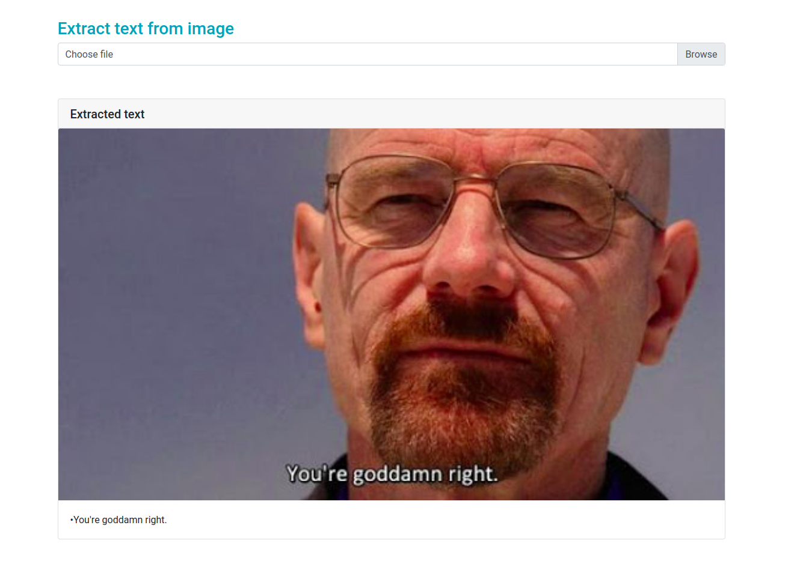

  <h3 align="center">Text extractor</h3>
 
  

   This project allow to extract text from image using OCR api and display the result to the user.
    It only support english language.
     
  

## About The Project

 
The project contains two parts:
<ul>
  <li>the frontend part  built using Angular 9</li>
<li> the backend part a rest api built using spring boot, the ws recieve an image decoded in base64 and return 
  JsonOject that contains allo the info extracted from it</li>
  </ul>

## Demo

 
 
